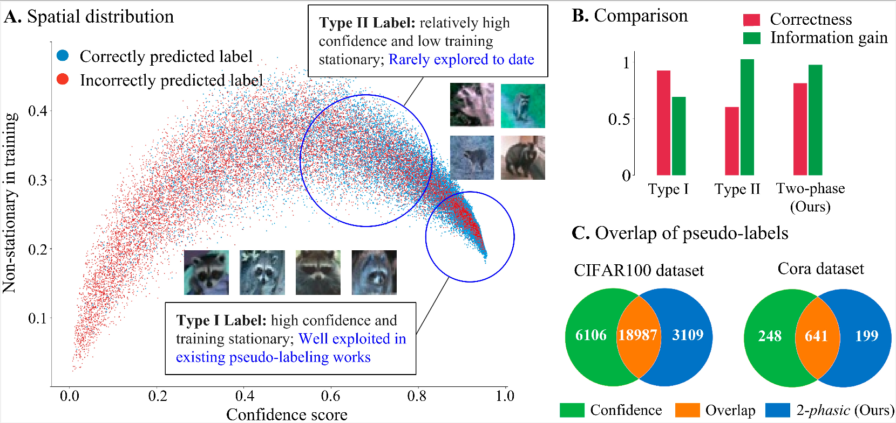

# Non-Stationary Predictions May Be More Informative: Exploring Pseudo-Labels with a Two-Phase Pattern of Training Dynamics
This repository contains the Code of the  model in the ICML’25 paper ["Non-Stationary Predictions May Be More Informative: Exploring Pseudo-Labels with a Two-Phase Pattern of Training Dynamics"](https://openreview.net/pdf?id=Xcnbtxns0V)



Type II labels refer to predicted labels with relatively high confidence scores but low training stationarity, which are rarely explored in existing pseudo-labeling methods. These labels, though less accurate, offer higher information gain for model learning, forming the basis of the proposed two-phase labels that switch categories during training.

## Key Concepts
We identifies **Type II labels** (high-confidence but non-stationary predictions) and introduces **two-phase labels** as their subset exhibiting a two-phase training dynamic (early/late prediction shifts), proposing a 2-phasic metric to characterize their spatial and temporal patterns and a specialized loss to leverage non-stationary predictions for semi-supervised learning enhancement.

## Working Process:  
1. **Training Dynamics Collection**: Train a base model on labeled data and baseline pseudo-label data, recording prediction trajectories (softmax distributions) of unlabeled samples across epochs to capture spatial and temporal patterns.  
2. **Two-Phase Label Identification**: Use the 2-phasic metric to screen samples with two-phase dynamics:  
   - **Spatial Measure**: Employ Leave-Maximum-Out (LMO) entropy to detect bimodal prediction distributions.  
   - **Temporal Measure**: Quantify two observations of two-phase training dynamics in the temporal pattern.  
3. **Pseudo-Label Generation**: Select low-2-phasic samples, assigning pseudo-labels based on their latest-stage predictions.  
4. **Two-Phase Loss Training**: Optimize models with a specialized loss function.

## Usage
This repository's code is divided into two parts (graph data and image data). For respective environment configurations and execution instructions, please refer to the README under each folder.

## References
If you find the code useful for your research, please consider citing

```
@inproceedings{peitwophase,
  title={Non-Stationary Predictions May Be More Informative: Exploring Pseudo-Labels with a Two-Phase Pattern of Training Dynamics},
  author={Pei, Hongbin and Hai, Jingxin and Li, Yu and Deng, Huiqi and Ma, Denghao and Ma, Jie and Wang, Pinghui and Tao, Jing and Guan, Xiaohong},
  booktitle={Forty-second International Conference on Machine Learning}
}
```
