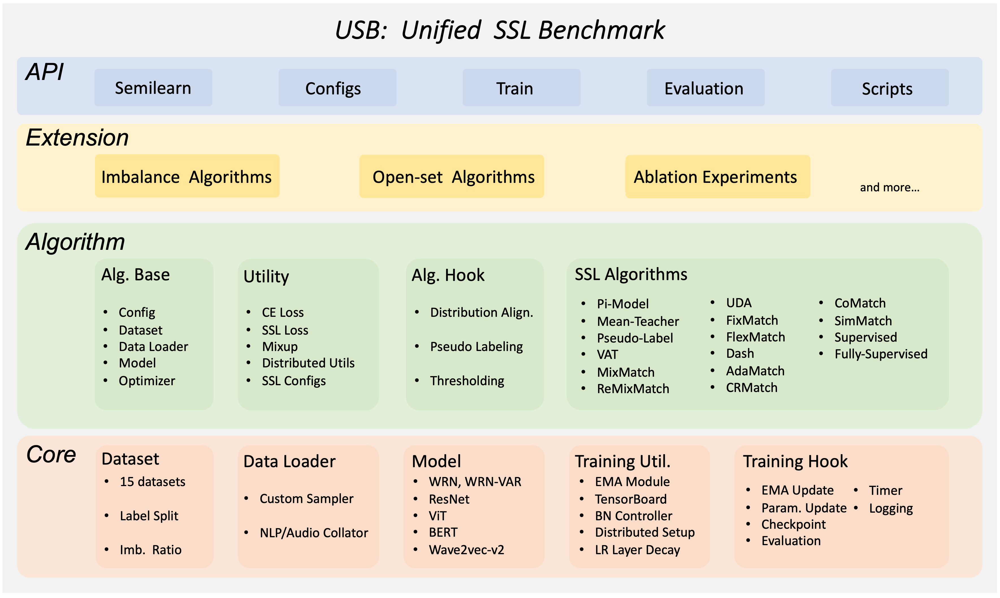

<div id="top"></div>
<!--
*** Thanks for checking out the Best-README-Template. If you have a suggestion
*** that would make this better, please fork the repo and create a pull request
*** or simply open an issue with the tag "enhancement".
*** Don't forget to give the project a star!
*** Thanks again! Now go create something AMAZING! :D
-->

<!-- PROJECT SHIELDS -->

<!--
*** I'm using markdown "reference style" links for readability.
*** Reference links are enclosed in brackets [ ] instead of parentheses ( ).
*** See the bottom of this document for the declaration of the reference variables
*** for contributors-url, forks-url, etc. This is an optional, concise syntax you may use.
*** https://www.markdownguide.org/basic-syntax/#reference-style-links
-->

<!-- 
***[![MIT License][license-shield]][license-url]
-->

<!-- PROJECT LOGO -->

<br />
<div align="center">
  <a href="https://github.com/microsoft/Semi-supervised-learning">
    
  </a>

<!-- <h3 align="center">USB</h3> -->

<p align="center">
    <strong>USB</strong>: A Unified Semi-supervised learning Benchmark for CV, NLP, and Audio Classification
    <!-- <br />
    <a href="https://github.com/microsoft/Semi-supervised-learning"><strong>Explore the docs »</strong></a>
    <br /> -->
    <br />
    <a href="https://arxiv.org/abs/2208.07204">Paper</a>
    ·
    <a href="https://github.com/microsoft/Semi-supervised-learning/tree/main/results">Benchmark</a>
    ·
    <a href="https://colab.research.google.com/drive/1lFygK31jWyTH88ktao6Ow-5nny5-B7v5">Demo</a>
    ·
    <a href="https://usb.readthedocs.io/en/main/">Docs</a>
    ·
    <a href="https://github.com/microsoft/Semi-supervised-learning/issues">Issue</a>
    ·
    <a href="https://www.microsoft.com/en-us/research/lab/microsoft-research-asia/articles/pushing-the-limit-of-semi-supervised-learning-with-the-unified-semi-supervised-learning-benchmark/">Blog</a>
    ·
    <a href="https://medium.com/p/849f42bbc32a">Blog (Pytorch)</a>
    ·
    <a href="https://zhuanlan.zhihu.com/p/566055279">Blog (Chinese)</a>
    ·
    <a href="https://nips.cc/virtual/2022/poster/55710">Video</a>
    ·
    <a href="https://www.bilibili.com/video/av474982872/">Video (Chinese)</a>
  </p>
</div>

<!-- TABLE OF CONTENTS -->

<details>
  <summary>Table of Contents</summary>
  <ol>
    <li><a href="#intro">Introduction</a></li>
    <li>
      <a href="#getting-started">Getting Started</a>
      <ul>
        <li><a href="#prerequisites">Prerequisites</a></li>
        <li><a href="#installation">Installation</a></li>
      </ul>
    </li>
  </ol>
</details>


<!-- Introduction -->

## Introduction

The implementation of all CV benchmarks is based on USB. **USB** is a Pytorch-based Python package for Semi-Supervised Learning (SSL). It is easy-to-use/extend, *affordable* to small groups, and comprehensive for developing and evaluating SSL algorithms. **You can find the specific running commands in the "Reproduce CV Benchmark Results" section**.




<p align="right">(<a href="#top">back to top</a>)</p>

<!-- GETTING STARTED -->

## Getting Started

This is an example of how to set up USB locally.
To get a local copy up, running follow these simple example steps.

### Prerequisites

USB is built on pytorch, with torchvision, torchaudio, and transformers.

To install the required packages, you can create a conda environment:

```sh
conda create --name usb python=3.8
```

then use pip to install required packages:

```sh
pip install -r requirements.txt
```
<p align="right">(<a href="#top">back to top</a>)</p>


### Prepare Datasets

The detailed instructions for downloading and processing are shown in [Dataset Download](./preprocess/). Please follow it to download datasets before running or developing algorithms.

<p align="right">(<a href="#top">back to top</a>)</p>

### reproduce cv benchmark results

Here is an example to train Two-phase base on Pseudolabel in CIFAR-100 Dataset with 200 labels. Training other supported algorithms (on other datasets with different label settings) can be specified by a config file:

- Step1: Training base model
```
python train.py --c config/two_phase/pseudolabel/cifar_base200.yaml
```
- Step2: Continue training two-phase 
```
python train.py --c config/two_phase/pseudolabel/cifar_tp200.yaml
```

